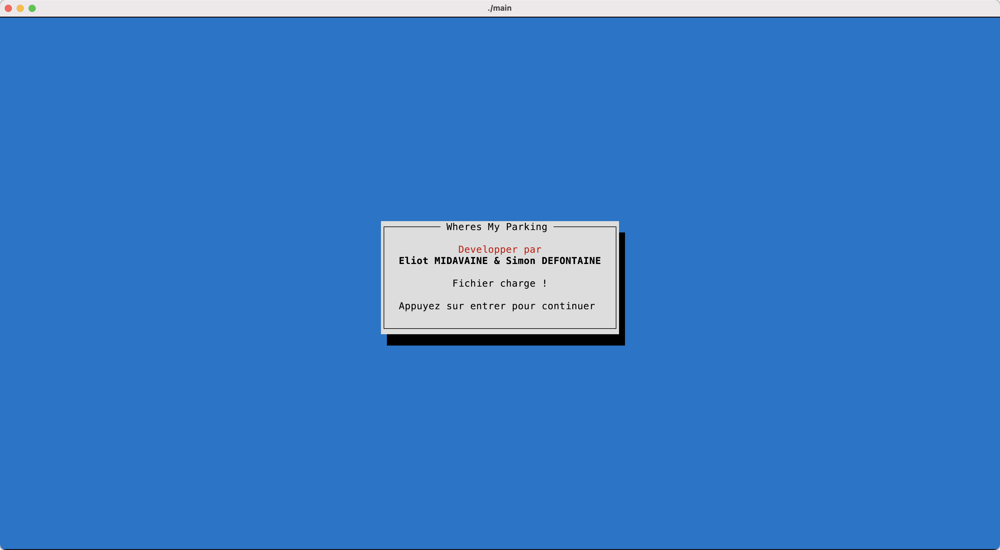
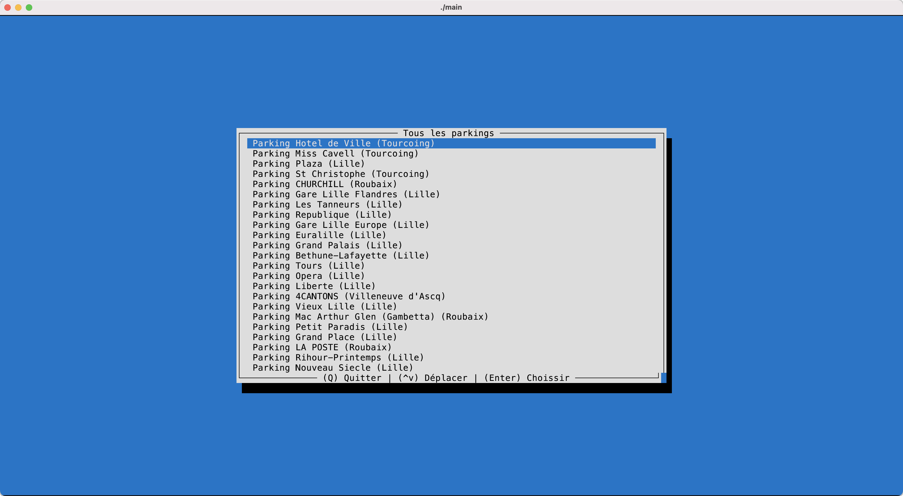

# Wheres My Parking

[](https://github.com/Bolmog1/WheresMyParking/)

> WheresMyParking est un projet pour le cours de *Langage C*

## Dépendances

Le projet est dépendant de **ncurses**.

## Installation

Télécharger le repo puis compiler via

```bash
gcc main.c toolbox.c -o ./main -lncurses
```

Executer via

```bash
./main
```

## Capture d'écran


